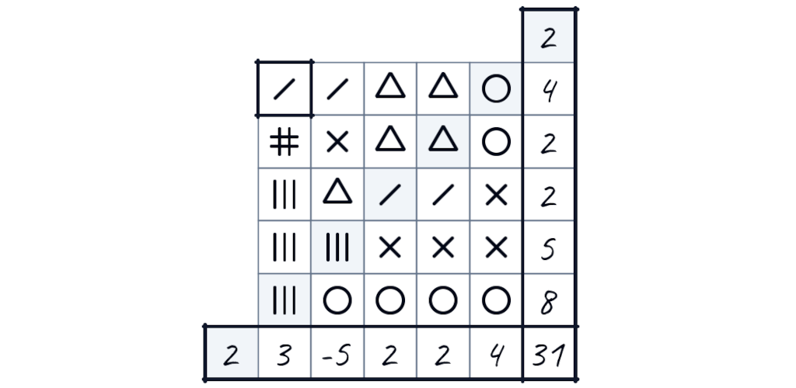

## The Detrak dice game!

Roll the dice and note the symbols in your grid to score as many points as possible!

To win, you will have to keep an eye on all the rows and columns and try to create sequences of 2, 3, 4, or even 5 identical symbols!

<!--     
 -->

Detrak is a PWA — a Progressive Web App — hosted at [detrak.net](https://detrak.net).

You can play online directly, and if you want, install it on your device — search for "Install" or "Add to home screen" in your browser's menu.

> [!NOTE]
> Detrak used to be present on the Google Play store, but I had to remove it because Google starting requiring independent developers to publicly disclose personal information, including our home address.

<!--  -->

Detrak is a Gigamic game – [gigamic.com/jeu/detrak](https://www.gigamic.com/jeu/detrak)

This digital version has been made with their approval. Thank you, Gigamic!

Copyright © Gigamic for the original game – Copyright © [Zwyx.dev](https://zwyx.dev) for this app

**Gigamic has forbidden any commercial use. For this reason, this repository is not licenced, and is only available for the purpose of review and commentary.**

